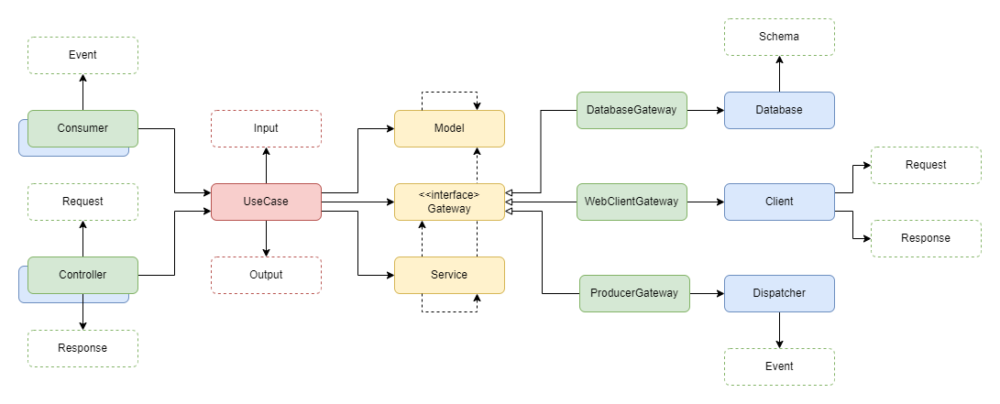
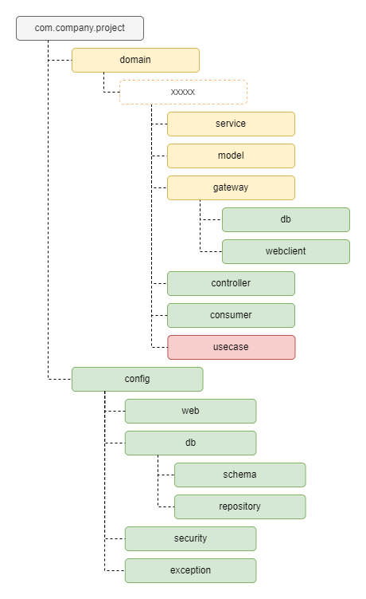

# Arquitetura Limpa Simplificada

#### Esse post é uma continuação direta desse outro post
[Do SOLID à Arquitetura Limpa](https://www.tabnews.com.br/TraineeCodeplays/do-solid-a-arquitetura-limpa)

Fala pessoal! Beleza?

Nesse post quero continuar no assunto de Arquitetura Limpa para apresentar uma variação mais simplificada dela. Essa abordagem é uma excelente substituda do modelo de três camadas que a gente costuma utilizar (Controller - Services - Repository).

Em resumo, a Arquitetura Limpa propõe mecanismos e ferramentas para que desenvolvedores construam softwares que sejam manutenível e expansíveis, tornando códigos de regra de negócio mais abstratos, com responsabilidades bem definidas e independentes de códigos de infraestrutura.

Alcançar o Estado da Arte da Arquitetura Limpa pode ser trabalhoso, algo custoso para se construir e manter, e tem casos onde isso não vale a pena. Por isso, há um capítulo onde o autor fala sobre Limites Parciais, que explica que alguns limites arquiteturais podem ser quebrados dependendo da análise de quem está arquitetando o software. Ele pode decidir manter ou não algum limite arquitetural.

Atualmente, para a maioria dos projetos comerciais, é inviável construir um software sem utilizar algum framework. Eles resolvem muitos problemas comuns e aceleram o ciclo de desenvolvimento, ao mesmo tempo que eles podem ser muito invasivos e acabar sujando o código, criando um acoplamento muito forte, tornando seu código refém dele.

### Arquitetura Limpa e Framework

Em aplicações comerciais feitas em Java/Kotlin é muito comum utilizar Spring como Framework. Ferramentas como Spring Boot, Spring MVC e Spring Data salvam a vida de muitos desenvolvedores todos os dias trazendo muito beneficios como segurança, produtividade, padronização, etc.

**Mas como ter uma Arquitetura Limpa trabalhando junto como o Framework?**

O diagrama a seguir mostra uma forma de conciliar o isolamento das regras de negócio e a utilização de frameworks para lidar com códigos boilerplate. Para isso, a regra da dependência pode ser quebrada entre as camadas de frameworks (azul) e adapters (verde), pois nessas camadas não existirão códigos de negócios e é justamente nessas camadas que os frameworks consumam atuar. Para as camadas de Use Case (vermelho) e Entity (amarelo), devemos manter a regra da dependência para manter o isolamento, já que são responsáveis pelo real funcionamento da aplicação - são os códigos que queremos manter fechados para alteração, mas abertos para extensão.

Nota-se que não existem setas que saem de uma Entity para apontar para qualquer outro componente e que as setas que saem do Use Case só apontam para Entities. Isso garante que o coração da aplicação não depende da infraestrutura que o sustenta.

**Sugestão para organização de Pacotes**  

A ideia é agrupar por domínio, onde todos os códigos relacionados um domínio estejam em um lugar centralizado. Porém, códigos ORM e Repository ficam separados pois gosto de considerar eles como configurações.

Lembre-se que não existe bala de prata. Em software, tudo depende.

