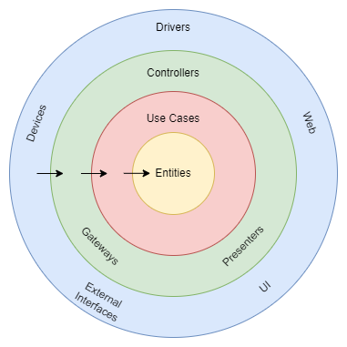

# Arquitetura Limpa para Aplicações com Spring

A Arquitetura Limpa, criada por Robert Martin, é baseada na Arquitetura Hexagonal, na arquitetura DCI (Data, Context and Interaction), BCE (Entity, Control and Boundary) e tem sua base fundada nos princípios SOLID e na Regra da Dependência. Sendo complementada pelos princípios de componentes.

Em resumo, ela propõe mecanismos e ferramentas para que desenvolvedores construam softwares capazes de serem extensíveis e com responsabilidades bem definidas. Essa característica é alcançada ao tornar códigos de regra de negócio mais abstratos, com responsabilidades bem definidas e independentes de códigos de infraestrutura.

Alcançar o Estado da Arte da Arquitetura Limpa pode ser um grande trabalho, algo caro para se construir e manter, e em alguns casos isso não vale a pena. Por isso, há um capítulo onde o autor fala sobre Limites Parciais, que explica que alguns limites arquitetônicos podem ser quebrados dependendo da análise do desenvolvedor (Arquiteto de Software). Ele pode decidir manter ou não algum limite Arquitetural.

Atualmente, para a maioria dos projetos comerciais, é inviável construir um software sem utilizar algum framework. Eles abstraem muitos problemas e aceleram o ciclo de desenvolvimento. Ao mesmo tempo, eles podem ser muito invasivos e acabar sujando seu código, criando um acoplamento muito forte e tornando seu código refém dele.

ARQUITETURA LIMPARA PARA APLICAÇÕES COM SPRING FRAMEWORK

Utilizar Spring Framework em aplicações Java/Kotlin é algo muito comum para o desenvolvimento de aplicações comerciais. Ferramentas como Spring Boot, Spring MVC e Spring Data salvam a vida de muitos desenvolvedores todos os dias.

O diagrama a seguir mostra uma forma de conciliar o isolamento das regras de negócio e a utilização de frameworks para construir aplicações comerciais. A regra da dependência pode ser quebrada entre as camadas de frameworks (azul) e adapters (verde), pois nessas camadas não existiram códigos de negócios. Para as camadas de Use Case (vermelho) e Entity (amarelo), deve-se manter a regra da dependência, para isolar essas camadas responsáveis pelo real funcionamento da aplicação.

Nota-se que não existem setas que saem de um Entity para apontar para qualquer outro componente. E que as setas saem do Use Case só apontam para Entities. Isso garante que o core da aplicação não depende da infraestrutura que o sustenta.

Para organização de pacotes, tem-se a seguinte proposta. Nota-se como cada camada da Arquitetura estão separadas em três pacotes base: Entity, Use Case e Infrastructure (frameworks e adapters).

